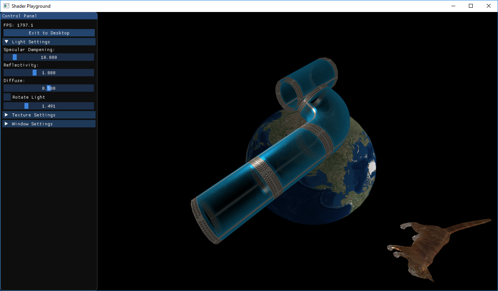

## Shader Playground

This is an educational project with the purpose of exploring model graphics APIs.

It combines the following 3rd-party componnents:
1. [easylogging++](https://github.com/muflihun/easyloggingpp) - for thread-safe logging
2. [glew](http://glew.sourceforge.net/) - for modern OpenGL headers
3. [glfw](http://www.glfw.org/) - for cross-platform window and event management
4. [imgui](https://github.com/ocornut/imgui) - for light-weight UI
5. [linalg](https://github.com/sgorsten/linalg) - for vectors and matrix calculations
6. [OBJ-loader](https://github.com/Bly7/OBJ-Loader) - for 3D assets loading
7. [STB Image](https://github.com/nothings/stb) - for JPG / PNG texture loading
8. [ArcBall Camera](https://github.com/nlguillemot/arcball_camera) - for easy camera manipulation in 3D
9. [ReaderWriterQueue](https://github.com/cameron314/readerwriterqueue) - for threading

The library is built with CMake and should be compatible with Windows, Linux and Mac OS (not yet tested).

Currently the library implements VAO / VBO management, fragment and vertex shader loading, basic specular lighting.

The code is licensed under [Apache 2.0](LICENSE).